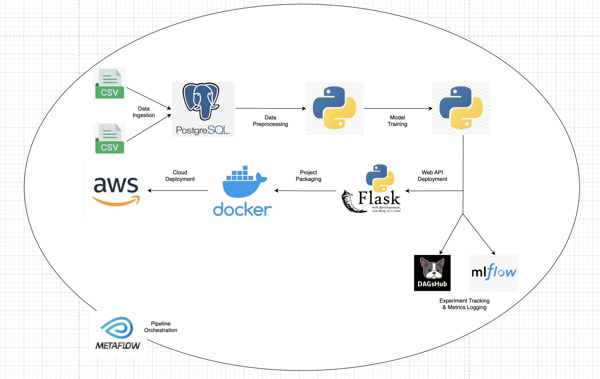
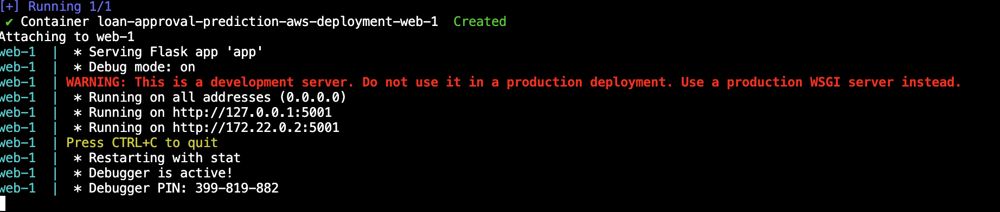
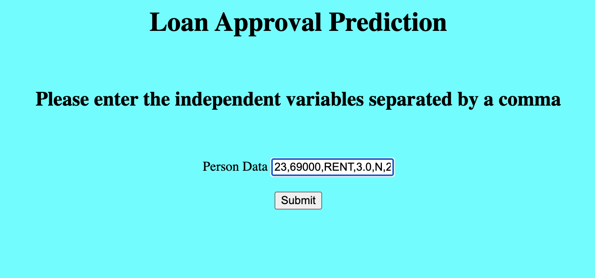
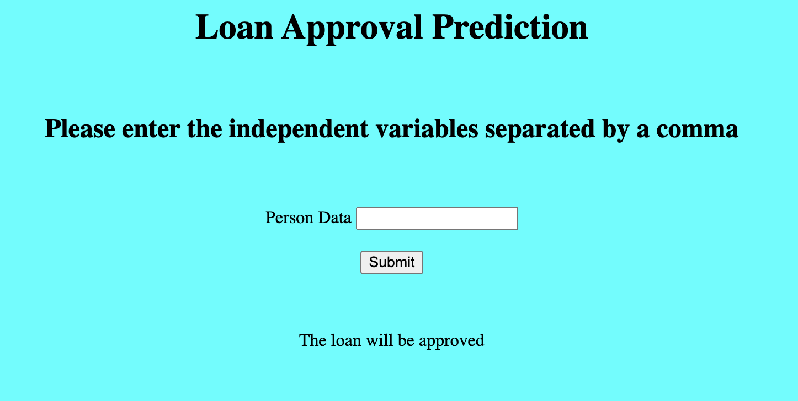

<!-- Writing the header for the project -->
<h1 align="center">Loan Approval Prediction Application</h1>

<!-- Accessing the image of the project workflow -->
<div align="center">
    
</div>

<br><br>

### Description

<p> This project creates an end-to-end Machine Learning pipeline to predict whether an individual's loan will be approved or not based on the details of the individual and the loan they seek. The flow of the entire pipeline along with all the tools used at each step has been explained in the image above. This project has been packaged using Docker so that anyone can execute the project without having to worry about incompatibilities in the project dependencies. The dataset used for this project is found on Kaggle.</p>

<br>

### Steps to execute

1) Create a .env file in the same directory as the Dockerfile and add the following configurations in it. Replace the database, user and password with the ones exclusive to your postgres database.<br>
```
POSTGRES_DATABASE = <your-project-database>
POSTGRES_USER = <your-postgres-username>
POSTGRES_PASSWORD = <your-postgres-password>
POSTGRES_HOST = "localhost"
POSTGRES_PORT = 5432
```

2) Build the project's docker image and execute it with the following command <br>
```
docker-compose up
```
<br>

3) Click on one of the links shown in the output <br><br>


4) Enter one of the row of inputs from data/sample/sample_inputs.csv<br><br>


5) Click the Submit button to see whether the loan will be approved or not<br><br>
